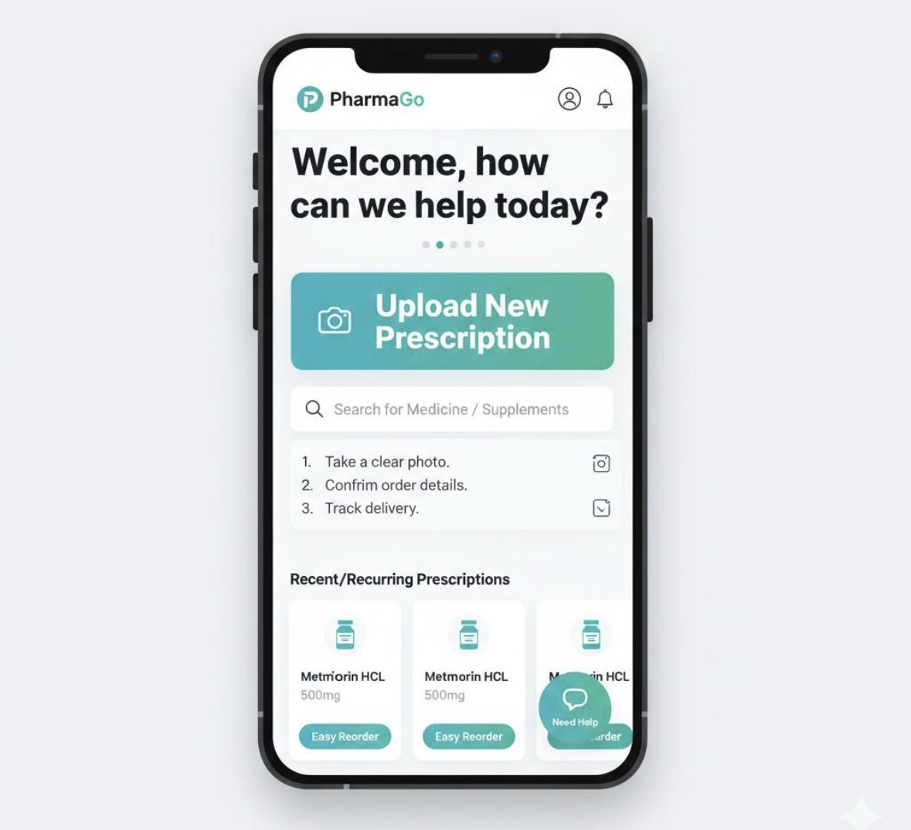
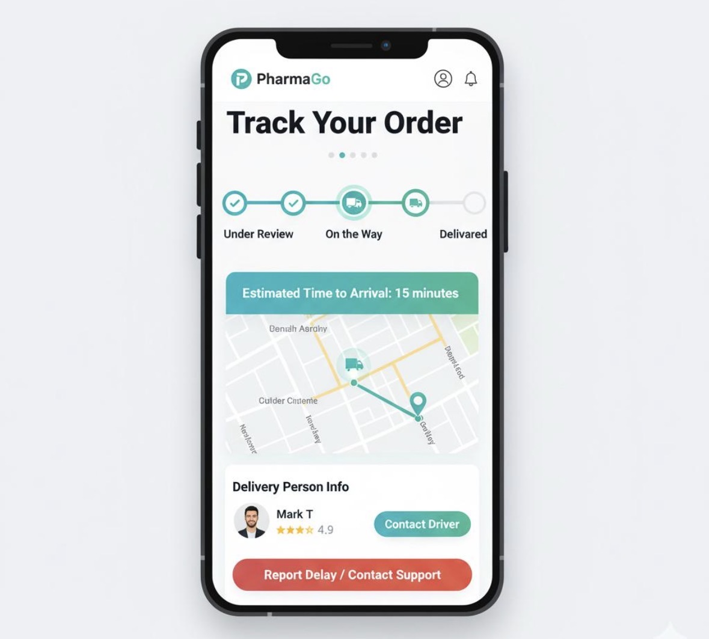
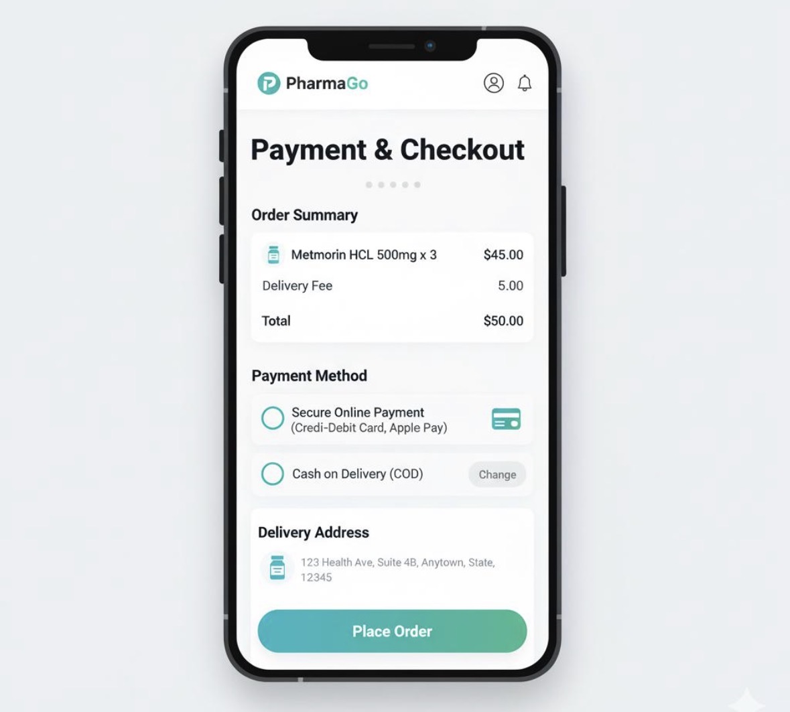

# PharmaGo App

A mobile application designed to improve access to medications through prescription upload, order tracking, and delivery services.

## Features
- Upload prescriptions
- Track orders in real time
- Manage medications and reminders
- Secure payment options

## Focus
This project focuses on user experience (UI/UX) and usability testing to improve accessibility and efficiency for users.

## Status
Completed as part of a Human-Computer Interaction course project.
## Screenshots

